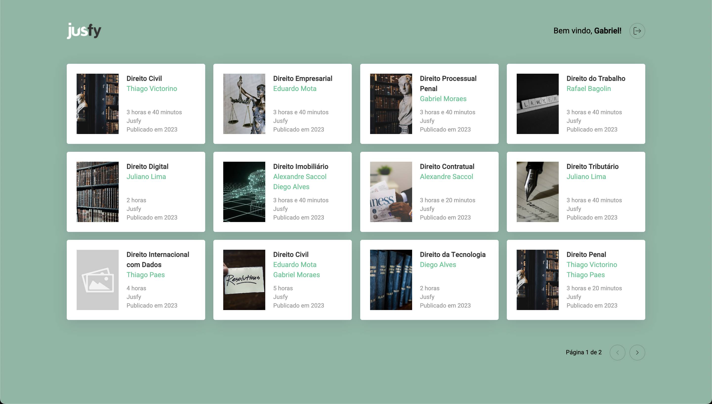

# Jusfy Courses Challange

Welcome to the README of this React project!

This project is an application for a course platform that includes login functionality and provides a listing and detailed view of courses.

In this application, you will find an organized structure following the best practices of React development. I have implemented essential concepts to ensure clean and maintainable code.

The API integration allows for efficient retrieval and display of courses. Upon logging in, users gain access to exclusive features and can explore the details of each available course.

Furthermore, the application features a responsive layout that seamlessly adapts to different devices and screen sizes.

I am excited to share the details and implemented features of this project. Feel free to explore the source code and learn more about this course platform developed in React.

## Demo

You can check out a live demo of this application by visiting the following link: [https://courses-challenge-jusfy.vercel.app/](https://courses-challenge-jusfy.vercel.app/)

At the provided link, you will be able to explore and interact with the application firsthand. Experience the login functionality, browse the course listings, and view detailed information about each course.

Feel free to navigate through the application, test its features, and get a glimpse of its functionality.

## Screenshots

Here are some screenshots showcasing the appearance and features of the application:

### Login Page

<div align="center">
   
</div>

The login page allows users to access the platform with their credentials. Authentication ensures that only authorized users can access the platform's resources.

### Home Page - Course Listing

<div align="center">
   
</div>

On the home page, users can view a list of available courses. Each course is presented with a brief description and an illustrative image, providing an overview of the offered content.

### Course Details

<div align="center">
   
</div>

By clicking on a specific course, users are directed to the course details page. On this page, they can find more detailed information such as duration, instructor, topics covered, and course requirements.

### Responsiveness

<div align="center" style="display: flex; flex-direction: row;">
   
   
</div>

The application is designed to be responsive, adapting to different devices and screen sizes. This screenshot exemplifies how the interface adjusts to provide a pleasant experience on mobile devices.

## Installation

Clone the project

```bash
  git@github.com:lucaspasseli/courses-challenge-jusfy.git
```

Go to the project directory

```bash
  cd courses-challenge-jusfy
```

Install dependencies

```bash
  npm install
```

Make sure you have Node.js installed on your machine, preferably version 16.19.0, to ensure compatibility with the project.

Once you have completed these steps, the project will be ready to run locally.

## Run Locally

After following the steps above in the "Installation" section, proceed with the following steps to start the server and access the application locally:

Start the server by running the following command:

```bash
  npm run start
```

This will start the server, and the application will be accessible at http://localhost:3000 in your web browser.

Note: Ensure that port 3000 is not already in use on your machine.

## Features

- Authentication
- Course listing
- Course details
- Login persistence
- Responsive layout
- Linter
- Code formatter
- Component documentation

## Tech Stack

- [React](https://react.dev/)
- [Typescript](https://www.typescriptlang.org/)
- [React Query](https://react-query.tanstack.com/)
- [React Router Dom](https://reactrouter.com/web/guides/quick-start)
- [Storybook](https://storybook.js.org/)
- [Styled Components](https://styled-components.com/)
- [React Loading](https://github.com/fakiolinho/react-loading)
- [Eslint](https://eslint.org/)
- [Prettier](https://prettier.io/)

## Design System

This project uses Storybook as a design system tool for component development. Storybook provides an interactive and isolated view of each component, making it easy to develop, test, and document the design system.

To run the Storybook locally, follow the steps below:

```bash
  npm run storybook
```

The Storybook server will start, and you can access it in your browser at http://localhost:6006.

To build an optimized version of the Storybook for deployment, run the following command:

```bash
  npm run build-storybook
```

This will create a storybook-static folder with the Storybook build files ready to be deployed to a server.

Now you can explore and visualize the design system components using the Storybook locally. Enjoy!

## Linter & Code Formater

This project utilizes ESLint and Prettier as code quality tools to enforce consistent code style and catch potential errors or issues.

- **ESLint** is a pluggable and configurable linter tool for identifying and reporting on patterns in JavaScript, TypeScript, and JSX code. It helps maintain code readability and improves code quality.

- **Prettier** is an opinionated code formatter that ensures consistent code formatting across your project. It helps enforce a unified coding style and minimizes debates over code formatting.

To run ESLint and check for code issues, use the following script:

```bash
  npm run lint
```

This will execute ESLint on the src/ directory and report any code violations or warnings.

To automatically fix ESLint issues, you can run the following script:

```bash
  npm run lint:fix
```

This will attempt to automatically fix any fixable ESLint issues in your codebase.

Additionally, to format your code using Prettier, use the following script:

```bash
  npm run format
```

This will format all relevant files in the src/ directory with the specified file extensions, such as .js, .jsx, .ts, .tsx, .css, .md, and .json, based on the configuration provided in the .prettierrc file.

By utilizing ESLint and Prettier in this project, you can ensure code consistency, maintainability, and readability throughout your codebase.

## API Reference

For detailed information about the API endpoints, request/response formats, authentication, and other relevant details, please refer to the [API Documentation](https://jusfy-desafio-tecnico.herokuapp.com/).

Make sure to consult the API documentation whenever you need to interact with the API endpoints in your application.

## Issues

Create a <a href="https://github.com/lucaspasseli/courses-challenge-jusfy/issues">new issue report</a>, it will be an honor to be able to help you solve and further improve our application.

## Appendix

This application is part of a technical challenge for the company Jusfy. The challenge aims to showcase technical skills and knowledge in software development.

To learn more about Jusfy and explore other projects and opportunities, visit their official website:

[Jusfy Website](https://jusfy.com.br/)

Feel free to explore the application and get in touch with the Jusfy team for more information about the technical challenge and their initiatives.

Made with 💖 by [Lucas Passeli](https://www.linkedin.com/in/lucas-passeli/).
